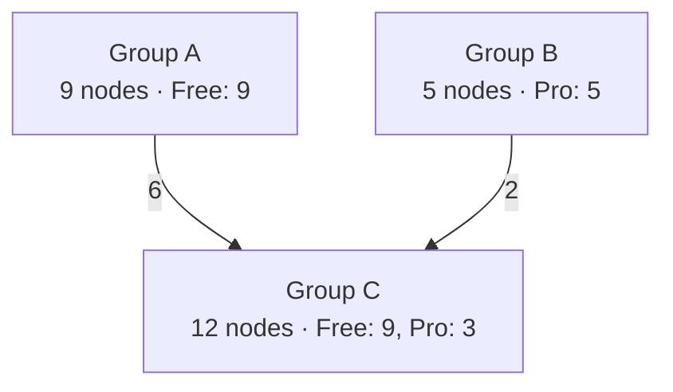
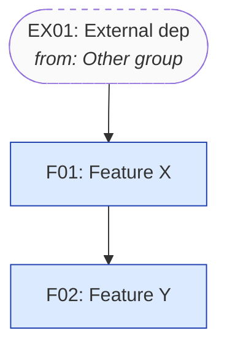

# Competitor Feature Map

Skill này giúp bạn dựng lại **bộ xương** của một sản phẩm đối thủ: feature nào là gốc, feature nào nhánh, feature nào phụ thuộc feature nào, user đi qua chúng theo thứ tự ra sao, và **toàn bộ map đó phức tạp đến đâu**. Output là 2 deliverable bổ trợ — markdown để đọc/review/share (Notion, Crisp), HTML interactive để zoom-pan-click khám phá.

## Tại sao dùng skill này

Khi audit competitor, người mới thường rơi vào 1 trong 2 bẫy:
1. **List phẳng tất cả feature** → mất hierarchy, không thấy feature nào quan trọng, không thấy feature nào phụ thuộc cái gì.
2. **Vẽ 1 sơ đồ duy nhất cố nhồi cả dependency + flow + pricing** → rối, không ai đọc được.

Skill này tách rõ 2 cấu trúc khác nhau: **dependency graph** (static, ai cần ai) và **flow map** (dynamic, user đi qua đâu trước đâu sau). Hai cấu trúc này nhìn cùng feature nhưng từ hai góc khác nhau, vẽ chung chỉ làm rối. Việc giữ chúng tách biệt là điểm cốt lõi.

Sau khi có 2 view đó, skill còn tổng hợp thành **1 bảng complexity duy nhất** — trả lời 4 câu hỏi: có bao nhiêu feature, bao nhiêu nhóm feature, bao nhiêu flow phụ thuộc lẫn nhau vs độc lập, và app này thuộc tier Simple / Moderate / Complex.

## Khi nào dùng vs khi nào không

**Dùng khi:**
- Cần hiểu kiến trúc tính năng đối thủ trước khi quyết định build feature tương tự
- Cần explain cho team "tại sao họ làm bước A trước bước B"
- Đang chuẩn bị PRD và muốn benchmark dependency tree với đối thủ
- Reverse engineer onboarding để lấy idea cho onboarding của mình
- Cần con số "app này nặng cỡ nào" để estimate effort clone hoặc build alternative

**KHÔNG dùng khi:**
- Chỉ cần biết giá / review / positioning → dùng `shopify-competitor-research`
- Chỉ cần JTBD / pain point từ góc nhìn merchant → dùng `customer-audit-brainstorm`
- Chỉ cần list các feature → một bảng đơn giản trong chat là đủ, không cần dựng map

## Workflow

Đi qua **5 bước** theo đúng thứ tự. Đừng skip bước 1-2 — nếu nhảy thẳng vào vẽ graph mà chưa có inventory chuẩn thì graph sẽ messy và phải làm lại. Đừng skip bước 3.5 (complexity summary) — đây là phần trả lời câu hỏi "map này nặng hay nhẹ" mà user thường hỏi đầu tiên.

### Bước 1 — Xác định source data

Hỏi user (nếu chưa rõ) đang có data từ nguồn nào trong số:

a. **Link App Store / website đối thủ** → dùng `WebFetch` để lấy listing. Nếu page client-rendered (React SPA, dashboard sau login), escalate sang `mcp__claude-in-chrome__navigate` + `get_page_text`.
b. **Screenshot do user upload** (uploads folder) → đọc trực tiếp, OCR nếu cần.
c. **Báo cáo từ `shopify-competitor-research`** → đọc file markdown đó, lấy feature matrix làm seed cho inventory.
d. **User mô tả bằng lời** → ask follow-up để rút đủ feature names trước khi vẽ.

Thường sẽ là hỗn hợp. Đừng giả định — confirm với user nguồn nào available rồi mới crawl. Crawl thừa tốn token và đôi khi bị restricted.

### Bước 2 — Build feature inventory (nodes)

Đây là bước quan trọng nhất. Trước khi vẽ bất kỳ graph nào, phải có **danh sách feature có cấu trúc**.

Mỗi feature là 1 node với các trường:

| Field | Ý nghĩa | Ví dụ |
|---|---|---|
| `id` | Mã ngắn unique, format `F001` | `F003` |
| `name` | Tên feature theo cách đối thủ gọi | `Pickup location` |
| `type` | Phân loại logic — xem `references/feature-taxonomy.md` | `Entity` |
| `layer` | **Architectural layer feature LIVES IN** (cứng, dùng cho swimlane). 1 trong **5**: `Shopify Platform` / `External` / `Backend` / `Admin` / `Storefront` | `Admin` |
| `actor` | **Ai trực tiếp tương tác với feature**. 1 trong 3: `Merchant` / `Buyer` / `System` | `Merchant` |
| `trigger` | **Cái gì kích hoạt node** (Action chủ yếu). Vd: `user_click` / `webhook_orders_create` / `cron_daily` / `merchant_save` / `shopify_flow` / `api_call` / `system_event` / `none` | `webhook_orders_create` |
| `data_store` | **Data persist ở đâu**. 1 trong: `shopify_metafield` / `shopify_tag` / `line_item_attr` / `shopify_order` / `app_db` / `both` / `external` / `none` | `app_db` |
| `sync_mode` | Action chạy đồng bộ (block request) hay async (background)? `sync` / `async` / `n/a` | `async` |
| `api_scopes` | Shopify OAuth scope feature này cần (array). Vd `["read_orders","write_metafields"]` | `["read_products"]` |
| `plan` | Thuộc pricing tier nào (nếu phát hiện được) | `Pro` |
| `prerequisites` | List `id` các feature bắt buộc phải có trước | `[F001, F002]` |
| `enables` | List `id` các feature mà feature này mở khoá | `[F010]` |
| `group` | **Nhóm feature logic** (cluster theo function/module, KHÁC `layer`). Optional nhưng KHUYẾN KHÍCH — dùng cho complexity summary đếm "có bao nhiêu group feature". Vd: `Booking core`, `Notification`, `Pickup & delivery`, `Reporting`, `Billing`, `Onboarding`. Nếu để trống → fallback dùng `layer` làm group. | `Booking core` |
| `description` | 1-2 câu mô tả | `Cho phép merchant tạo nhiều pickup points` |
| `evidence` | Nguồn observed (screenshot caption, URL, KB article) | `Onboarding step 3, screenshot 2.png` |

**Khi nào field nào required:**
- `trigger`: required cho `type=Action`. Optional cho các type khác (Display/Setting/Entity thường có `trigger=none`).
- `data_store`: required cho `type=Entity` và `Setting`. Optional cho khác. Display/Integration thường `none`.
- `sync_mode`: required cho `type=Action`. `n/a` cho các type khác.
- `api_scopes`: required cho node nào TOUCH Shopify API (gọi GraphQL, listen webhook, ghi metafield). Empty array `[]` nếu không cần.
- `group`: optional. Nếu set → các feature cùng nhóm chức năng phải share cùng giá trị `group`. Đừng tạo group có 1 node — gộp vào group láng giềng hoặc bỏ trống.

**Tại sao 5 dimension mới quan trọng:** map cũ chỉ trả lời "feature nào có và phụ thuộc ai" — đủ để hiểu structure. 5 dimension mới trả lời "luồng vận hành thế nào":

- `trigger` cho biết feature chạy lúc nào (event-driven vs user-driven vs scheduled)
- `data_store` cho biết khi build copycat phải migrate gì (Shopify-native data vs custom DB)
- `sync_mode` cho biết kiến trúc execution (request-response vs job queue)
- `api_scopes` cho biết trust footprint (app xin càng nhiều scope càng đáng ngờ với merchant)
- `External` layer mới tách 3rd-party (Klaviyo, Twilio, S3) khỏi Shopify Platform — vì đây là 2 loại dependency khác nhau (Shopify là contract bắt buộc, External là tuỳ chọn)

**Tại sao 2 chiều `layer` + `actor` quan trọng:** map này không chỉ để hiểu feature, mà để hiểu **app architecture** của đối thủ. `layer` cho biết feature build ở đâu (frontend Polaris, backend service, theme extension, hay tích hợp Shopify primitive), `actor` cho biết ai chạm vào nó. Một feature có thể "ở Admin" theo surface nhưng thực ra logic chạy ở Backend — phân biệt rạch ròi giúp khi build copycat ta biết phần nào dev cần làm.

**Tại sao `group` quan trọng:** `layer` là chiều **kỹ thuật** (Backend / Admin / Storefront), còn `group` là chiều **chức năng** (Booking / Notification / Reporting). Một group có thể trải dài nhiều layer — vd "Notification" có node ở Backend (email service), Admin (template editor), Storefront (email render). Đếm số group cho biết "app này gánh bao nhiêu domain chức năng" — một app 5 group là focused, một app 12 group là sprawling.

### Quy ước layer (5 layer, top-down)

- **Shopify Platform**: Mọi thứ là *primitive* của Shopify mà app tận dụng — webhooks (orders/create, products/update, customers/create), Admin GraphQL API, Storefront API, App Bridge, Polaris contract, Billing API, Theme App Extension framework, Checkout UI Extension framework, Functions, Shopify Flow trigger/action, Locations API, Metafields, Tags, POS extension. Node loại này không phải "feature của app" mà là *contract* giữa app và Shopify.
- **External**: 3rd-party service KHÔNG thuộc Shopify ecosystem — Klaviyo, Mailchimp, Twilio, SendGrid, Stripe (nếu không qua Shopify Payments), AWS S3, Sentry, Mixpanel, Postmark, Google Calendar, Zapier. Khác Shopify Platform vì đây là **tuỳ chọn** (merchant có thể không bật), trong khi Shopify Platform là **bắt buộc** với mọi Shopify app.
- **Backend**: Service do app tự build, không user-facing — cron job, queue, internal API, database model, calculation engine, scheduled task, webhook handler logic, email sender service.
- **Admin**: Embedded admin UI trong Shopify Admin — Polaris page, settings form, list view, detail page, onboarding wizard, merchant-facing analytics.
- **Storefront**: Surface customer thấy — theme block (product page widget), checkout UI extension, customer account page, transactional email rendering, public booking page.

### QUAN TRỌNG: Shopify Platform nodes phải INFER, không chỉ observed

Không một Shopify app nào tồn tại mà KHÔNG dùng webhooks, Admin API, theme/checkout extension, và Billing API. Nhưng phần này hiếm khi xuất hiện trong feature bullets / KB / screenshot — vì đối thủ không marketing chúng. Nếu bạn build map dựa thuần tuý vào observed data, swimlane Shopify Platform sẽ trống → map bị thiếu nửa kiến trúc.

**Quy tắc**: Với BẤT KỲ Shopify app nào, MẶC ĐỊNH suy luận tối thiểu 4-7 Shopify Platform nodes, mark `evidence: "INFERRED from app category"` và `actor: "System"`. Checklist tối thiểu để rà:

1. **Webhooks lắng nghe** — app loại pickup/delivery chắc chắn nghe `orders/create`, có thể `orders/updated`, `products/update`. App booking nghe thêm `customers/create`. App subscription nghe `subscription_contracts/*`. Mỗi webhook = 1 node.
2. **Admin GraphQL/REST** — app gọi để CRUD Product / Order / Customer / Location / Discount metafield. Gộp thành 1 node "Admin GraphQL access" nếu không phân biệt được, hoặc tách per resource nếu rõ.
3. **Storefront API** — chỉ tạo node nếu app có public-facing JS (booking page tại non-Shopify domain). Hầu hết app embed không cần.
4. **Theme App Extension framework** — bắt buộc nếu app có theme block / app embed.
5. **Checkout UI Extension framework** — bắt buộc nếu app inject UI vào Checkout (thường cho deposit, date picker on cart, custom delivery field).
6. **Shopify Flow** — chỉ tạo node nếu research/changelog nhắc tới Flow trigger/action.
7. **Billing API** — bắt buộc với mọi paid app. Bao gồm subscription billing và usage-based billing.
8. **Functions** — chỉ với app shipping/discount/payment có custom logic chạy ở checkout.
9. **Polaris/App Bridge** — bắt buộc với mọi embedded admin app. Tạo 1 node "App Bridge embedded surface" để biểu thị app sống trong Shopify Admin frame.
10. **Metafields / Tags** — bắt buộc nếu app cần persist data vào Shopify entity (vd deposit % per product, booking config per product). Tạo node "Product/Order metafield write" hoặc "Order tag (method/location)".

Mỗi node Shopify Platform thường là `prerequisite` cho 1+ feature ở layer khác. Vd: "Order webhook listener" (Platform) → "Booking record creation" (Backend) → "Bookings list page" (Admin). Edge này tiết lộ flow data từ Shopify vào app.

Nếu sau khi rà checklist này swimlane Platform vẫn < 4 nodes → kiểm tra lại, bạn đang miss platform dependencies.

### Quy ước actor

- **Merchant**: shop owner / staff. Tương tác qua Admin layer chủ yếu.
- **Buyer**: customer cuối cùng. Tương tác qua Storefront, Checkout, email.
- **System**: tự động — không ai click. Backend job, webhook handler, scheduled task. Cũng dùng cho Shopify Platform nodes mà app chỉ "lắng nghe" thụ động.

Lưu inventory dưới dạng JSON trong outputs folder (tên: `<competitor-slug>-inventory.json`). JSON này sẽ làm input cho cả markdown và HTML ở bước 4.

**Đừng tạo node cho mọi pixel bạn thấy.** Nếu một thứ chỉ là tooltip giải thích, không phải feature riêng — bỏ. Nếu hai feature thực ra là 2 view của cùng 1 thing — gộp. Mục tiêu là 15-40 node, không phải 200. Quá ít → mất chi tiết. Quá nhiều → graph không đọc nổi.

### Bước 3 — Phân loại dependency vs flow

Một sai lầm phổ biến: trộn lẫn "feature A cần feature B mới chạy được" (dependency) với "user thường làm A trước B" (flow). Hai cái này khác nhau bản chất:

- **Dependency** là quan hệ **logic/kỹ thuật**: muốn dùng "Recurring order" thì BẮT BUỘC phải có "Subscription product type". Quan hệ này không đổi.
- **Flow** là quan hệ **temporal/UX**: user thường xem dashboard → tạo product → set rule → publish. Quan hệ này phụ thuộc persona và journey.

Vẽ 2 diagram riêng:

a. **Dependency graph** (Mermaid `graph TD` hoặc HTML swimlane). Edge có hướng nghĩa là "phụ thuộc". **Cluster các node theo `layer` thành 5 swimlane ngang**, thứ tự top-down: `Shopify Platform` → `External` → `Backend` → `Admin` → `Storefront`. Trong mỗi swimlane, **color nodes theo `actor`**: Merchant = xanh dương, Buyer = xanh lá, System = xám. Hai chiều này cho thấy đồng thời "feature live ở layer nào" và "ai chạm vào nó".

b. **Flow map** (Mermaid `flowchart LR` hoặc HTML swimlane). Mỗi persona (vd: `Merchant onboarding`, `Customer ordering`, `Customer rescheduling`) là 1 swimlane. Mỗi step trỏ về `id` của feature trong inventory.

Vẽ đủ 2-4 persona flow là đủ. Không cần vẽ flow cho mọi edge case — chỉ những flow lộ ra cấu trúc thú vị.

### Bước 3.5 — Đo độ phức tạp map (complexity summary)

Sau khi inventory + flow đã ổn, tính ra **1 block `complexity_summary`** trả lời 4 câu hỏi user hay hỏi đầu tiên: có bao nhiêu feature, bao nhiêu group, bao nhiêu flow dependent/independent, app này nằm tier nào.

Block này được **inject vào JSON inventory** (xem schema trong `references/output-templates.md`), in vào markdown header, và render thành stat bar trong HTML.

#### 3.5.1 — Đếm feature & feature group

- `total_features` = `nodes.length`
- `independent_features` = số node có `prerequisites.length === 0` (root — không phụ thuộc ai)
- `dependent_features` = `total_features - independent_features`
- `feature_groups_count` = số distinct `group` value (skip null/empty)
  - Nếu **không node nào** có `group` → fallback `feature_groups_count = distinct(layer)` (= số swimlane có node), mark `feature_groups_source: "layer_fallback"`.
- `feature_groups` = mảng `{name, node_count}` sort theo `node_count` desc

**Sanity check:** một group có 1 node thì gộp hoặc bỏ. Mục tiêu group là cluster ≥ 2 feature cùng domain.

#### 3.5.2 — Phân loại flow dependent vs independent

Định nghĩa chính xác (nếu thay đổi định nghĩa thì sửa cả ở đây và HTML):

> **Flow X là `independent` nếu** **TẤT CẢ** step đầu tiên (step[0]) của X trỏ về 1 feature mà `prerequisites = []` HOẶC prerequisites của feature đó **chỉ chứa Shopify Platform nodes** (tức flow này có thể bắt đầu mà không cần flow nào khác chạy trước, chỉ cần Shopify primitive). Một flow như "Merchant onboarding" thường independent.
>
> **Flow X là `dependent` nếu** step[0] trỏ về feature có ≥ 1 prerequisite ở layer **Backend/Admin/Storefront/External** (tức trước khi flow này bắt đầu, một flow khác phải đã set up state đó). Một flow như "Customer ordering" thường dependent — vì state pickup location, working hours, bookable product phải có sẵn từ flow merchant onboarding.

Compute:
- `total_flows` = `flows.length`
- `independent_flows` = số flow thoả điều kiện independent ở trên
- `dependent_flows` = `total_flows - independent_flows`
- Mỗi flow nên có thêm field `dependency_type: "independent" | "dependent"` và `depends_on_flows: []` (tên flow phải chạy trước, suy từ feature ownership) để debug.

**Alternative định nghĩa (nếu user yêu cầu):** flow dependent = flow chia sẻ ≥ 1 feature với flow khác. Đây là "coupling" góc nhìn, không phải "sequencing" góc nhìn. Nếu user chọn cách đếm này thì note `flow_classification_mode: "coupling"` trong summary.

#### 3.5.3 — Graph metrics

- `total_edges` = sum `prerequisites.length` qua tất cả node
- `max_dependency_depth` = longest path trong DAG (BFS từ mỗi root, lấy max). Nếu graph có cycle (không nên có) → mark `has_cycle: true` và in warning.
- `avg_prerequisites` = `total_edges / total_features`, làm tròn 1 chữ số thập phân
- `hub_features` = top 3 node có (`prerequisites.length + enables.length`) cao nhất — feature "trục" mà nhiều thứ phụ thuộc

#### 3.5.4 — Rating Simple / Moderate / Complex

Compute từ 4 dimension dưới (mỗi dimension cho điểm 1/2/3 — Simple/Moderate/Complex):

| Dimension | Simple (1đ) | Moderate (2đ) | Complex (3đ) |
|---|---|---|---|
| **Size** (`total_features`) | ≤ 15 | 16–30 | > 30 |
| **Depth** (`max_dependency_depth`) | ≤ 3 | 4–5 | > 5 |
| **Interconnection** (`avg_prerequisites`) | < 1.2 | 1.2–2.0 | > 2.0 |
| **Group sprawl** (`feature_groups_count`) | ≤ 4 | 5–7 | > 7 |

`complexity_score` = sum 4 điểm (range 4–12).

`complexity_rating`:
- `Simple` nếu `complexity_score ≤ 5`
- `Moderate` nếu `complexity_score 6–9`
- `Complex` nếu `complexity_score ≥ 10`

Luôn kèm `complexity_reasoning`: 1-2 câu giải thích vì sao rơi vào tier đó (vd "32 features > ngưỡng 30 và max depth 6 cho thấy chain dài; ratio prerequisite 2.1 nói phần lớn node phụ thuộc nhau → Complex"). Đây là phần insightful — đừng để trống.

### Bước 3.6 — Per-group decomposition (auto-trigger khi ≥ 8 groups)

Khi inventory có nhiều functional group, 1 mega-graph với 50+ node trở nên không đọc nổi. Skill SHOULD tự break inventory thành 2 view bổ trợ — **system overview** (groups as super-nodes) và **per-group sub-maps** (1 zoom-in map cho mỗi group).

**Heuristic auto-trigger:**

| `feature_groups_count` | Decomposition |
|---|---|
| 1–7 groups | SKIP — graph tổng vẫn đọc được |
| 8–12 groups | RECOMMENDED — sinh overview + per-group |
| ≥ 13 groups | REQUIRED — không sinh = map không usable |

Khi trigger, sinh thêm **1 file song song** với markdown chính: `<slug>-feature-map-by-group.md`. File này KHÔNG replace `<slug>-feature-map.md` — nó là deliverable bổ sung.

#### 3.6.1 — Compute inter-group & intra-group edges

```
inter_edges[(src_group, dst_group)] = count of edges A→B where group(A) ≠ group(B)
intra_edges[group] = list of edges A→B where group(A) === group(B)
cross_in[group] = list of (prereq_id, node_id) where prereq is in another group
```

Mỗi inter-group edge có **weight** = số cross-group dependency. Edge `A → B (weight=6)` đọc là: 6 feature trong group B phụ thuộc 6 feature trong group A.

#### 3.6.2 — System overview Mermaid



Quy tắc cho super-node label:
- Line 1: tên group (rút gọn nếu > 30 char)
- Line 2: `{N} nodes · {plan distribution}`

Quy tắc cho edge:
- Hướng từ provider (prereq side) → consumer (depend side)
- Label = weight (count of cross-group deps)

Quy tắc cho color (per group's **primary layer** = layer chiếm đa số nodes):
- Shopify Platform → vàng
- External → tím
- Backend → xám
- Admin → xanh dương
- Storefront → xanh lá

#### 3.6.3 — Per-group sub-maps Mermaid

Cho mỗi group, sinh 1 Mermaid:
- Internal nodes (full color theo layer)
- Cross-group **prerequisites only** show as dashed-border node với label `from: <other group>`
- KHÔNG show outgoing cross-group edges (sẽ xuất hiện ở sub-map của consumer group, tránh duplicate)
- Intra-group edges đầy đủ



Sau mỗi sub-map, render `<details><summary>Nodes in group</summary>` chứa bảng node của group (collapsible vì có thể dài).

#### 3.6.4 — Per-group section structure

Mỗi group section trong markdown có format:

```markdown
### {idx}. {group name}

**Stats:** {N} nodes · Plan: {distribution} · Layer: {distribution}
**Internal hub:** `{id}` — {name} ({P} prereqs, {E} enables)

[Mermaid diagram]

<details><summary>Nodes in group</summary>
| ID | Name | Type | Layer | Plan | Prerequisites |
| ... |
</details>
```

Order các group: foundation (most outgoing cross-edges) → consumers. Thường thứ tự:
1. Shopify Platform integration
2. External services
3. Core engine groups
4. Notification/communication groups
5. Storefront / UI groups

#### 3.6.5 — HTML side: Groups overview view

HTML template (`assets/feature-map-template.html`) auto-render Groups overview khi data có `group` field. Layout:

- Filter panel thêm section **Group** (sau Layer, trước Actor)
- View toggle thêm button thứ 3 **"Groups overview"** (giữa Dependency và User flow)
- Khi click "Groups overview": ẩn graph SVG, hiện grid card 1 card / group, mỗi card show: name, node count, intra-edges, plan pills, top 3 enables, top 3 depends-on
- Click 1 card → auto-filter group đó + chuyển về Dependency view (= drill-down sub-map)

Code mẫu cho `renderGroupOverview()` đã include sẵn trong template — không cần handcraft.

### Bước 4 — Sinh output

Skill xuất ra **2-3 file song song** trong outputs folder:

1. `<competitor-slug>-feature-map.md` — markdown report theo template trong `references/output-templates.md`. Có sẵn section: tóm tắt, **bảng complexity summary**, inventory table, dependency Mermaid (graph tổng), flow Mermaid theo persona, observations.

2. `<competitor-slug>-feature-map.html` — copy file `assets/feature-map-template.html` xong inject JSON inventory vào placeholder `__FEATURE_DATA__`. File này self-contained, mở bằng browser, có **complexity stat bar** ở header, **Group filter trong filter panel**, **3 view toggle: Dependency / Groups overview / User flow**, click node để xem detail.

3. **(Conditional)** `<competitor-slug>-feature-map-by-group.md` — sinh THÊM khi `feature_groups_count ≥ 8` (xem heuristic ở Bước 3.6). File này chứa: system overview Mermaid (groups as super-nodes) + per-group sub-maps (N Mermaid, mỗi group 1 cái). Đây là deliverable bổ sung, KHÔNG replace file (1).

Cuối cùng share **tất cả** link cho user kèm 1 đoạn ngắn "đây là 3 insight nổi nhất khi audit map này + tier complexity" — không phải để khoe, mà để user biết chỗ nào đáng zoom in trước.

## Một số tip quan trọng

**Phân biệt observed vs inferred.** Nếu bạn thấy feature qua screenshot/KB → mark `evidence` rõ. Nếu bạn suy đoán dependency vì "chắc là vậy" → vẫn ghi vào nhưng note `evidence: "inferred"`. User cần biết cái gì chắc, cái gì đoán.

**Pricing tier reveals dependency.** Nếu feature B chỉ unlock ở plan Pro trong khi A ở Free, và feature B yêu cầu A → quan hệ này là `prerequisite` mạnh. Đừng bỏ qua trang pricing.

**Onboarding reveals priority.** Thứ tự step trong onboarding của đối thủ tiết lộ feature nào họ coi là core. Feature nào bị skip được, feature nào bắt buộc → ghi vào `description`.

**Empty state reveals expectation.** Khi user chưa có data, UI hiển thị gì cũng là feature (vd "create your first product" CTA = onboarding feature node).

**Group theo function, không theo UI section.** "Settings page" không phải group — đó là 1 surface. Group đúng phải là "Notification" (gồm email template + SMS template + notification queue worker), "Reporting" (gồm dashboard + export + scheduled email report). Hỏi: nếu xoá toàn bộ group này, đối thủ vẫn còn app hoạt động không? Nếu có → group đúng là module độc lập.

**Complexity rating không phải value judgment.** "Complex" không có nghĩa app tệ — nhiều app Complex vì cover nhiều use case. Rating chỉ ra effort estimate: clone Simple app tốn 4-8 tuần, Moderate 2-4 tháng, Complex 6-12 tháng. Note context này khi present cho user.

**Nếu user chain từ `shopify-competitor-research`**, đừng làm lại từ đầu. Đọc file báo cáo, lấy feature matrix làm seed cho inventory. Bổ sung thêm các trường `prerequisites`, `enables`, `evidence`, `group` mà báo cáo gốc không có.

## Reference files

- `references/methodology.md` — Giải thích sâu hơn về 5-step framework, ví dụ minh hoạ với 1 app booking, kèm worked example tính complexity_summary từng dòng.
- `references/feature-taxonomy.md` — Phân loại 5 type feature (Entity / Setting / Action / Display / Integration) với ví dụ.
- `references/output-templates.md` — Template markdown đầy đủ với Mermaid skeleton + placeholder + complexity table schema.

## Assets

- `assets/feature-map-template.html` — HTML scaffold dùng vis-network từ CDN, có 2 view toggle (dependency / flow), filter panel, detail sidebar khi click node, **complexity stat bar** ở header auto-tính từ JSON.

## Khi gặp data thiếu

Nếu chỉ có 1-2 screenshot, đừng cố vẽ map đầy đủ — sẽ làm map sai. Thà ask user upload thêm, hoặc đề xuất chạy `competitor-research` trước để có base. Nói rõ "data hiện tại đủ để map ~30% feature, có thể bổ sung X, Y, Z để cover thêm" thay vì im lặng vẽ ra một map ảo.

**Khi data thiếu, complexity rating cũng phải downgrade trust.** Nếu inventory có data_quality = "limited", mark `complexity_summary.confidence: "low"` và note trong reasoning ("rating dựa trên 12 feature observed, có thể app có thêm 10-15 feature chưa quan sát được → tier thực tế có thể cao hơn 1 bậc").
