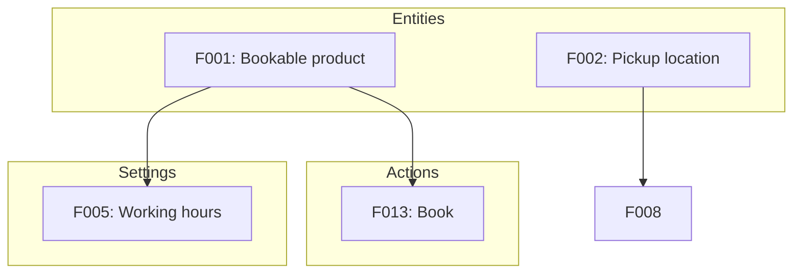
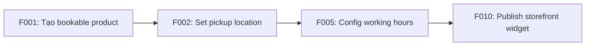
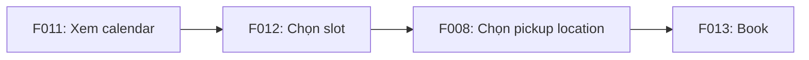
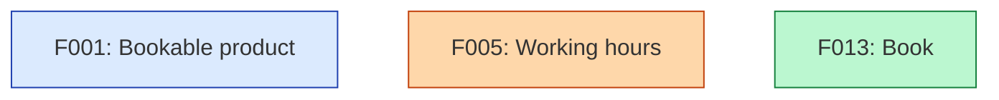
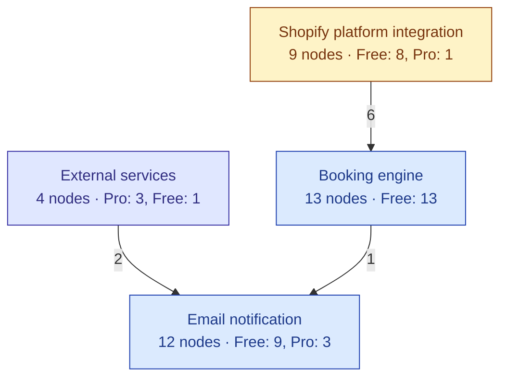
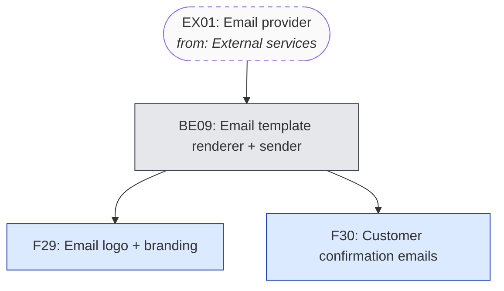

# Output Templates

Hai template song song: markdown report (`<slug>-feature-map.md`) và inventory JSON (`<slug>-inventory.json`). HTML là `assets/feature-map-template.html` đã có sẵn — bạn chỉ cần inject JSON.

## 1. JSON inventory schema

Đây là single source of truth. Markdown và HTML đều đọc từ đây. Khối `complexity_summary` (mới) ở cuối — compute từ `nodes` và `flows`, KHÔNG nhập tay.

```json
{
  "competitor": {
    "name": "BookFast",
    "url": "https://apps.shopify.com/bookfast",
    "category": "Shopify booking app",
    "audit_date": "2026-05-19",
    "data_quality": "good | limited | inferred",
    "sources": [
      "App Store listing",
      "Onboarding screenshots (3 files)",
      "KB article: Recurring bookings"
    ]
  },
  "nodes": [
    {
      "id": "F001",
      "name": "Product metafield (bookable)",
      "type": "Setting",
      "layer": "Shopify Platform",
      "actor": "System",
      "trigger": "merchant_save",
      "data_store": "shopify_metafield",
      "sync_mode": "sync",
      "api_scopes": ["write_metafields"],
      "plan": "Free",
      "prerequisites": [],
      "enables": ["F003", "F005", "F010"],
      "group": "Booking core",
      "description": "App ghi metafield vào Product để đánh dấu bookable. Đây là Shopify primitive, không phải custom DB.",
      "evidence": "Inferred from KB 'How bookable products work'"
    },
    {
      "id": "F002",
      "name": "Pickup location (entity)",
      "type": "Entity",
      "layer": "Backend",
      "actor": "System",
      "trigger": "none",
      "data_store": "app_db",
      "sync_mode": "n/a",
      "api_scopes": ["read_locations"],
      "plan": "Free",
      "prerequisites": [],
      "enables": ["F008", "F011"],
      "group": "Pickup & delivery",
      "description": "App lưu pickup location trong DB riêng (Shopify Location object không đủ field).",
      "evidence": "Inferred from admin UI showing custom fields per location"
    },
    {
      "id": "F003",
      "name": "Pickup location settings page",
      "type": "Display",
      "layer": "Admin",
      "actor": "Merchant",
      "trigger": "none",
      "data_store": "none",
      "sync_mode": "n/a",
      "api_scopes": [],
      "plan": "Free",
      "prerequisites": ["F002"],
      "enables": ["F004"],
      "group": "Pickup & delivery",
      "description": "Polaris page trong admin để merchant CRUD location.",
      "evidence": "Onboarding screenshot 2"
    },
    {
      "id": "F010",
      "name": "Booking widget (theme block)",
      "type": "Display",
      "layer": "Storefront",
      "actor": "Buyer",
      "trigger": "none",
      "data_store": "none",
      "sync_mode": "n/a",
      "api_scopes": [],
      "plan": "Free",
      "prerequisites": ["F001", "F002"],
      "enables": ["F013"],
      "group": "Booking core",
      "description": "Theme App Extension block hiển thị calendar trên product page.",
      "evidence": "App Store screenshot 3"
    },
    {
      "id": "E001",
      "name": "Klaviyo API",
      "type": "Integration",
      "layer": "External",
      "actor": "System",
      "trigger": "api_call",
      "data_store": "external",
      "sync_mode": "n/a",
      "api_scopes": [],
      "plan": "Free",
      "prerequisites": [],
      "enables": ["F014"],
      "group": "Notification",
      "description": "3rd-party Klaviyo event tracking API. Backend integration node (F014) gọi tới đây để push order events.",
      "evidence": "Mentioned in app feature bullets"
    }
  ],
  "flows": [
    {
      "persona": "Merchant onboarding",
      "dependency_type": "independent",
      "depends_on_flows": [],
      "steps": [
        {"feature_id": "F001", "label": "Tạo bookable product"},
        {"feature_id": "F002", "label": "Set pickup location"},
        {"feature_id": "F005", "label": "Config working hours"},
        {"feature_id": "F010", "label": "Publish storefront widget"}
      ]
    },
    {
      "persona": "Customer ordering",
      "dependency_type": "dependent",
      "depends_on_flows": ["Merchant onboarding"],
      "steps": [
        {"feature_id": "F011", "label": "Xem booking calendar"},
        {"feature_id": "F012", "label": "Chọn slot"},
        {"feature_id": "F008", "label": "Chọn pickup location"},
        {"feature_id": "F013", "label": "Book"}
      ]
    }
  ],
  "complexity_summary": {
    "total_features": 32,
    "independent_features": 6,
    "dependent_features": 26,
    "feature_groups_count": 5,
    "feature_groups_source": "explicit",
    "feature_groups": [
      {"name": "Booking core",       "node_count": 11},
      {"name": "Pickup & delivery",  "node_count": 7},
      {"name": "Notification",       "node_count": 6},
      {"name": "Reporting",          "node_count": 4},
      {"name": "Onboarding",         "node_count": 4}
    ],
    "total_flows": 4,
    "independent_flows": 1,
    "dependent_flows": 3,
    "flow_classification_mode": "sequencing",
    "total_edges": 51,
    "max_dependency_depth": 5,
    "avg_prerequisites": 1.6,
    "has_cycle": false,
    "hub_features": [
      {"id": "F001", "name": "Product metafield (bookable)", "degree": 9},
      {"id": "F002", "name": "Pickup location (entity)",     "degree": 7},
      {"id": "F005", "name": "Working hours setting",        "degree": 6}
    ],
    "complexity_score": 9,
    "complexity_rating": "Moderate",
    "complexity_breakdown": {
      "size":            {"value": 32,  "tier": "Complex",  "points": 3},
      "depth":           {"value": 5,   "tier": "Moderate", "points": 2},
      "interconnection": {"value": 1.6, "tier": "Moderate", "points": 2},
      "group_sprawl":    {"value": 5,   "tier": "Moderate", "points": 2}
    },
    "complexity_reasoning": "32 features vượt ngưỡng 30 (Complex theo size) nhưng depth chỉ 5 và avg-prerequisite 1.6 cho thấy graph rộng-nhưng-không-quá-sâu. 5 group chức năng là vừa phải — chưa sprawling. Kết quả Moderate, không Complex hẳn: clone app này ước lượng 3-4 tháng nếu có 2 dev fullstack.",
    "confidence": "medium"
  },
  "insights": [
    {
      "type": "core_path",
      "title": "Core path",
      "description": "Path Product → Calendar → Working hours là path mọi merchant phải đi qua. Đây là điểm leverage để invest UX."
    },
    {
      "type": "gating_choke",
      "title": "Gating choke",
      "description": "Recurring booking gate sau 4 feature dependency, chỉ unlock ở Pro plan — họ gate cố ý cho upsell."
    },
    {
      "type": "hidden_complexity",
      "title": "Hidden complexity",
      "description": "Cancel & refund phụ thuộc 6 feature khác — phức tạp hơn vẻ bề ngoài."
    }
  ]
}
```

## 2. Markdown template

```markdown
# Feature Map: {{competitor.name}}

**URL:** {{competitor.url}}
**Category:** {{competitor.category}}
**Audit date:** {{competitor.audit_date}}
**Data quality:** {{competitor.data_quality}}

## Sources

{{#each competitor.sources}}- {{this}}
{{/each}}

## Độ phức tạp map

| Metric | Giá trị |
|---|---|
| Tổng feature | {{complexity_summary.total_features}} |
| ↳ Feature độc lập (root, không prerequisite) | {{complexity_summary.independent_features}} |
| ↳ Feature phụ thuộc (có ≥1 prerequisite) | {{complexity_summary.dependent_features}} |
| Số nhóm feature (group) | {{complexity_summary.feature_groups_count}} {{#if feature_groups_source == "layer_fallback"}}*(fallback theo layer — chưa gán `group` thủ công)*{{/if}} |
| ↳ Phân bổ | {{#each feature_groups}}{{name}} ({{node_count}}){{#unless @last}} · {{/unless}}{{/each}} |
| Tổng flow | {{complexity_summary.total_flows}} |
| ↳ Flow độc lập (tự chạy được) | {{complexity_summary.independent_flows}} |
| ↳ Flow phụ thuộc (cần flow khác setup trước) | {{complexity_summary.dependent_flows}} |
| Tổng cạnh dependency | {{complexity_summary.total_edges}} |
| Depth tối đa (longest chain) | {{complexity_summary.max_dependency_depth}} |
| Trung bình prerequisite / feature | {{complexity_summary.avg_prerequisites}} |
| Hub features (top 3 degree) | {{#each hub_features}}{{id}} {{name}}{{#unless @last}}, {{/unless}}{{/each}} |
| **Đánh giá tổng thể** | **{{complexity_summary.complexity_rating}}** ({{complexity_summary.complexity_score}}/12) |
| Confidence | {{complexity_summary.confidence}} |

**Vì sao {{complexity_summary.complexity_rating}}:** {{complexity_summary.complexity_reasoning}}

### Complexity breakdown theo dimension

| Dimension | Giá trị | Tier | Điểm |
|---|---|---|---|
| Size | {{complexity_breakdown.size.value}} features | {{complexity_breakdown.size.tier}} | {{complexity_breakdown.size.points}}/3 |
| Depth | {{complexity_breakdown.depth.value}} | {{complexity_breakdown.depth.tier}} | {{complexity_breakdown.depth.points}}/3 |
| Interconnection (avg prerequisites) | {{complexity_breakdown.interconnection.value}} | {{complexity_breakdown.interconnection.tier}} | {{complexity_breakdown.interconnection.points}}/3 |
| Group sprawl | {{complexity_breakdown.group_sprawl.value}} groups | {{complexity_breakdown.group_sprawl.tier}} | {{complexity_breakdown.group_sprawl.points}}/3 |

## 3 insight chính

{{#each insights}}### {{title}}

{{description}}

{{/each}}

## Feature inventory ({{nodes.length}} nodes)

| ID | Name | Type | Layer | Group | Plan | Prerequisites | Evidence |
|---|---|---|---|---|---|---|---|
{{#each nodes}}| {{id}} | {{name}} | {{type}} | {{layer}} | {{group}} | {{plan}} | {{prerequisites}} | {{evidence}} |
{{/each}}

## Dependency graph

Edge `A → B` nghĩa là B phụ thuộc A (A là prerequisite). Cluster theo type.



## Flow maps

### Persona: Merchant onboarding *(independent — không cần flow nào chạy trước)*



### Persona: Customer ordering *(dependent — cần Merchant onboarding setup trước)*



## Observations chi tiết

### Pricing tier breakdown

- **Free**: F001, F002, F005, F010, F011, F012, F013 (core booking flow)
- **Pro**: F015 (recurring), F018 (custom email template), F020 (analytics)
- **Enterprise**: F025 (API access), F026 (white label)

### Empty states observed

- Khi chưa có product: "Add your first bookable product" CTA → trigger F001
- Khi chưa có location: skipable, fallback về delivery-only

### Onboarding insight

Onboarding bắt buộc step 1-3 (product, location, hours). Step 4 (publish widget) optional — gợi ý họ ưu tiên content setup hơn distribution.
```

## 3. Mermaid coloring tips

Khi vẽ dependency graph, dùng color theo type để dễ đọc. Mermaid syntax:



## 4. HTML template injection

File `assets/feature-map-template.html` có 2 placeholder:

- `__FEATURE_DATA__` — thay bằng JSON inventory (toàn bộ object trên)
- `__COMPETITOR_NAME__` — thay bằng `competitor.name`

Template auto-compute `complexity_summary` từ `nodes` + `flows` nếu **không có** sẵn trong JSON, và render stat bar ở header. Nếu JSON đã có `complexity_summary` → ưu tiên dùng giá trị đó (để bạn override reasoning bằng tay).

Replace bằng Python script đơn giản:

```python
import json
from pathlib import Path

inventory = json.load(open("bookfast-inventory.json"))
template = Path("assets/feature-map-template.html").read_text()
output = template.replace("__FEATURE_DATA__", json.dumps(inventory))
output = output.replace("__COMPETITOR_NAME__", inventory["competitor"]["name"])
Path("bookfast-feature-map.html").write_text(output)
```

Hoặc đơn giản hơn — đọc template, dùng Edit tool replace 2 chỗ, save ra file mới.

## 5. Pseudocode tính complexity_summary

Logic này được duplicate giữa Python (khi sinh markdown) và JS (trong HTML template). Giữ đồng bộ định nghĩa khi sửa.

```python
def compute_complexity(nodes, flows):
    n = len(nodes)
    by_id = {x["id"]: x for x in nodes}

    independent_features = sum(1 for x in nodes if not x.get("prerequisites"))
    dependent_features = n - independent_features

    # --- Groups ---
    groups_raw = [x.get("group") for x in nodes if x.get("group")]
    if groups_raw:
        groups_source = "explicit"
        group_keys = groups_raw
    else:
        groups_source = "layer_fallback"
        group_keys = [x.get("layer", "Unknown") for x in nodes]
    from collections import Counter
    group_counts = Counter(group_keys)
    feature_groups = [
        {"name": k, "node_count": v}
        for k, v in sorted(group_counts.items(), key=lambda kv: -kv[1])
    ]

    # --- Edges & depth ---
    total_edges = sum(len(x.get("prerequisites", [])) for x in nodes)
    avg_prereq = round(total_edges / n, 1) if n else 0

    # BFS longest path (assume DAG)
    memo = {}
    def depth(node_id, visiting=set()):
        if node_id in memo: return memo[node_id]
        if node_id in visiting: return 0   # cycle guard
        visiting = visiting | {node_id}
        prereqs = by_id.get(node_id, {}).get("prerequisites", [])
        d = 0 if not prereqs else 1 + max(depth(p, visiting) for p in prereqs)
        memo[node_id] = d
        return d
    max_depth = max((depth(x["id"]) for x in nodes), default=0)

    # --- Hub features ---
    in_deg = Counter()
    out_deg = Counter()
    for x in nodes:
        for p in x.get("prerequisites", []):
            in_deg[p] += 1   # p is depended on by x
            out_deg[x["id"]] += 1
    degree = {x["id"]: in_deg[x["id"]] + out_deg[x["id"]] for x in nodes}
    hub = sorted(nodes, key=lambda x: -degree[x["id"]])[:3]
    hub_features = [
        {"id": x["id"], "name": x["name"], "degree": degree[x["id"]]}
        for x in hub
    ]

    # --- Flow classification (sequencing mode) ---
    PLATFORM_LAYERS = {"Shopify Platform"}
    def flow_is_independent(flow):
        if not flow.get("steps"): return True
        first = flow["steps"][0]["feature_id"]
        node = by_id.get(first)
        if not node: return True
        prereqs = node.get("prerequisites", [])
        if not prereqs: return True
        # All prereqs must be Shopify Platform
        return all(
            by_id.get(p, {}).get("layer") in PLATFORM_LAYERS
            for p in prereqs
        )

    total_flows = len(flows)
    independent_flows = sum(1 for f in flows if flow_is_independent(f))
    dependent_flows = total_flows - independent_flows

    # --- Tier scoring ---
    def tier(value, simple_max, moderate_max):
        if value <= simple_max:    return ("Simple", 1)
        if value <= moderate_max:  return ("Moderate", 2)
        return ("Complex", 3)

    size_t, size_pts             = tier(n, 15, 30)
    depth_t, depth_pts           = tier(max_depth, 3, 5)
    inter_t, inter_pts           = tier(avg_prereq, 1.2, 2.0)
    grp_t, grp_pts               = tier(len(feature_groups), 4, 7)
    score = size_pts + depth_pts + inter_pts + grp_pts

    if score <= 5:   rating = "Simple"
    elif score <= 9: rating = "Moderate"
    else:            rating = "Complex"

    return {
        "total_features": n,
        "independent_features": independent_features,
        "dependent_features": dependent_features,
        "feature_groups_count": len(feature_groups),
        "feature_groups_source": groups_source,
        "feature_groups": feature_groups,
        "total_flows": total_flows,
        "independent_flows": independent_flows,
        "dependent_flows": dependent_flows,
        "flow_classification_mode": "sequencing",
        "total_edges": total_edges,
        "max_dependency_depth": max_depth,
        "avg_prerequisites": avg_prereq,
        "has_cycle": False,
        "hub_features": hub_features,
        "complexity_score": score,
        "complexity_rating": rating,
        "complexity_breakdown": {
            "size":            {"value": n,           "tier": size_t,  "points": size_pts},
            "depth":           {"value": max_depth,   "tier": depth_t, "points": depth_pts},
            "interconnection": {"value": avg_prereq,  "tier": inter_t, "points": inter_pts},
            "group_sprawl":    {"value": len(feature_groups), "tier": grp_t, "points": grp_pts}
        },
        "complexity_reasoning": "<fill by hand — 1-2 sentences explaining why this tier>",
        "confidence": "medium"   # downgrade to "low" if data_quality == "limited"
    }
```

**`complexity_reasoning` đừng tự sinh máy** — Claude phải viết tay 1-2 câu, dựa trên 4 dimension nào "lệch" nhiều nhất, để giải thích cho user vì sao rating ra như vậy. Đây là phần value cao nhất.

## 6. Per-group decomposition templates

Khi `feature_groups_count ≥ 8` (xem `SKILL.md` Bước 3.6), sinh thêm file `<slug>-feature-map-by-group.md` với 2 phần: **system overview** + **N per-group sub-maps**.

### 6.1 — System overview Mermaid template



**Quy tắc render:**

- Super-node label: line 1 = group name (rút gọn nếu > 30 char), line 2 = `{count} nodes · {plan distribution}`
- Edge direction: từ provider (prereq side) → consumer (depend side)
- Edge label: weight = `count of cross-group prerequisites`
- Color: theo group's **primary layer** (layer chiếm đa số nodes trong group)
- Order trong subgraph: foundation (most outgoing) → consumers

### 6.2 — Per-group sub-map Mermaid template



**Quy tắc render:**

- Internal nodes: full color (theo layer của node)
- Cross-group prereqs: dashed border + label `from: <other group>` (rút gọn nếu > 25 char)
- KHÔNG show outgoing cross-group edges từ group này — chúng sẽ xuất hiện ở sub-map của consumer group (tránh duplicate)
- Intra-group edges đầy đủ

### 6.3 — Markdown structure cho per-group file

```markdown
# Feature Map by Group: {{competitor.name}} ({{audit_type}})

**URL:** {{url}}
**Audit date:** {{date}}
**Total:** {{total_features}} features across {{groups_count}} groups
**Complexity:** {{rating}} ({{score}}/12)

> Map này được tổ chức theo **functional group** thay vì 1 mega-graph. Phần 1 là overview (N group super-nodes + inter-group edges). Phần 2 là N sub-maps chi tiết — mỗi sub-map zoom vào 1 group.

---

## 🗺️ System overview map ({{N}} groups)

Mỗi node = 1 functional group. Edge `A → B` = nhóm B có ≥ 1 feature phụ thuộc feature trong nhóm A. Label trên edge = số dependency.

[overview Mermaid here]

**Top depended-upon groups (foundation):**
1. **Group X** — Y downstream deps
2. **Group Y** — Z downstream deps
...

→ Insight: foundation group nào mất → bao nhiêu % feature không vận hành.

---

## 📦 Per-group detail maps ({{N}} sub-maps)

### 1. {{group_name}}

**Stats:** {{N}} nodes · Plan: {{distribution}} · Layer: {{distribution}}
**Internal hub:** `{{hub_id}}` — {{hub_name}} ({{P}} prereqs, {{E}} enables)

[per-group Mermaid]

<details><summary>Nodes in group</summary>

| ID | Name | Type | Layer | Plan | Prerequisites |
|---|---|---|---|---|---|
| ... |

</details>

### 2. {{next group}}
...

---

## Đọc map theo group này thế nào

1. **Overview map (Phần 1)** → "app có mấy mảng và mảng nào là foundation?"
2. **Sub-map từng group (Phần 2)** → "trong mảng X, feature nào depend feature nào?"
3. **Cross-reference**: thấy `[from: X]` trong sub-map của group Y → mở sub-map X để xem chi tiết.

**Use case suggested:**

- **PM scoping**: đọc overview để chốt MVP groups
- **Dev estimation**: đọc sub-map từng group + count external deps → estimate effort
- **Architecture review**: nhìn ai gọi ai để spot ownership boundary
```

### 6.4 — Order các group section

Order theo "foundation depth" — group nào nhiều downstream nhất ở trên:

1. **Foundation layer**: Shopify Platform → External services
2. **Core engine**: Booking engine / Availability engine
3. **Cross-cutting infra**: Order automation, Email notification
4. **Specialized channels**: SMS, WhatsApp, Push (theo thứ tự dùng nhiều)
5. **Optional / Pro features**: Waitlist, i18n, Subscriptions, Advanced workflows
6. **Surface**: Storefront widget, Calendar design (UI tokens), General preferences

Heuristic này không cứng — Claude có thể tùy chỉnh theo cấu trúc app cụ thể.

## 7. Naming convention

File output đặt theo pattern:
- `<competitor-slug>-inventory.json`
- `<competitor-slug>-feature-map.md`
- `<competitor-slug>-feature-map.html`
- `<competitor-slug>-feature-map-by-group.md` (chỉ khi groups ≥ 8)

Trong đó `<competitor-slug>` là tên app lowercase, dấu gạch ngang. Vd: `bookfast`, `tipo-booking`, `bird-pickup-delivery`.
